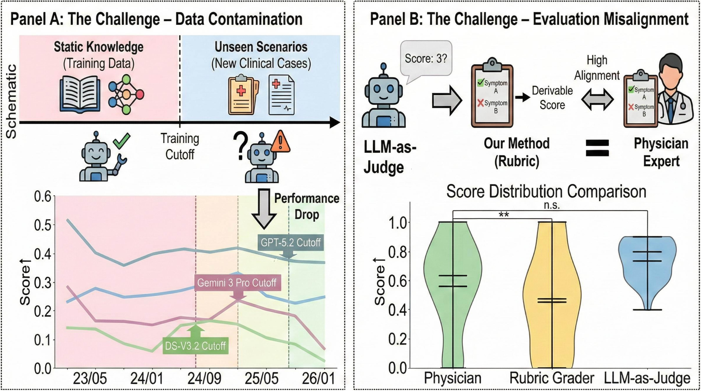

## LiveMedBench: A Live Medical Benchmark for LLMs

[](https://huggingface.co/datasets/JuelieYann/LiveMedBench/)

LiveMedBench is a benchmark for evaluating large language models (LLMs) on **real‑world, live update medical data**.  
It is designed to measure not only overall medical quality, but also **robustness over time** under a rubric‑based evaluation framework.

**Data is available at:** [Hugging Face Dataset](https://huggingface.co/datasets/JuelieYann/LiveMedBench/)

This repository contains:
- **Inference scripts** for running LLMs on the benchmark  
- **Evaluation scripts** for rubric‑based grading with GPT‑4.1  
- **Metric scripts** for aggregating scores over time

If you use LiveMedBench in your research, please consider citing and acknowledging this project (see the end of this document).

---

## 1. Repository Structure

```text
LiveMedBench/
  evaluate/
    run_model.py        # Run an LLM on LiveMedBench cases
    evaluate_model.py   # Use GPT‑4.1 as a rubric-based grader
    metric_calc.py      # Aggregate scores and compute metrics
  data/                 # (Expected) benchmark data folder – see below
  outputs/              # (Recommended) folder for model outputs and evaluations
```

This repo is intentionally **minimal and model‑agnostic**.  
You can plug in any OpenAI‑compatible chat model via its model name.

---

## 2. Benchmark Challenges

To better illustrate the motivation of LiveMedBench, we point out the challenge of current medical benchmarks:



This figure highlights the **core challenges** LiveMedBench aims to capture:
- **Live, time‑stamped medical cases** rather than static exam‑style questions.  
- **Rubric-based Evaluation** for specific cases, aligning well with physicians.  

Together, these aspects make LiveMedBench a realistic and challenging benchmark for modern medical LLMs.

---

## 3. Data Format and Location

LiveMedBench assumes the following data layout (you may adapt paths as needed):

- **Rubric‑augmented cases**

  ```text
  data/data_rubric.json
  ```

  Each entry augments a case with rubric items:

  ```json
  {
    "case_id": "1",
    "post_time": "2023-04-16T00:00:00",
    "narrative": "...",
    "core_request": "...",
    "doctor_advice": "...",
    "rubric_items": [
      {
        "criterion": "Does the model identify the likely cause as Norovirus?",
        "points": 10
      },
      {
        "criterion": "Does the model recommend antibiotics?",
        "points": -5
      }
    ]
  }
  ```

---

## 4. Environment Setup

We use the official `openai` Python client with **environment‑based credentials**.

```bash
conda create -n livemedbench python=3.10 -y
conda activate livemedbench

pip install openai
```

Set your OpenAI API key (no keys are stored in this repo):

```bash
export OPENAI_API_KEY="sk-..."  # DO NOT hard-code this in code
```

---

## 5. Running Models on LiveMedBench

The script `evaluate/run_model.py` runs a chat model on all cases and saves the responses.

### 5.1 Basic Usage

```bash
python evaluate/run_model.py \
  --data-file data/merged_data.json \
  --output-file outputs/gpt_4_1_results.json \
  --model gpt-4.1
```

Key arguments:
- **`--data-file`**: path to a JSON list of cases (`merged_data.json`).  
- **`--output-file`**: where to save model outputs.  
- **`--model`**: any OpenAI chat model name (e.g., `gpt-4.1`, `gpt-4.1-mini`, `gpt-5.2-*`).  
- **`--max-cases`** (optional): limit the number of processed cases (for debugging).  
- **`--resume`** (optional): resume from an existing output file by `case_id`.

### 5.2 Model Prompting

For each case, we build the prompt as:

```text
instruction  +  narrative  +  core_request
```

- If the content contains Chinese, we ask the model to answer **in Chinese** without intermediate reasoning.
- Otherwise we use an English instruction:  
  “Provide ONLY the final answer to the following question, without any explanation or reasoning steps.”

The resulting JSON output contains per‑case fields:

```json
{
  "post_time": "...",
  "narrative": "...",
  "core_request": "...",
  "model_response": "...",
  "finish_reason": "...",
  "doctor_advice": "..."
}
```

---

## 6. Rubric‑based Evaluation with GPT‑4.1

The script `evaluate/evaluate_model.py` uses **GPT‑4.1 (version `gpt-4.1-2025-04-14`)** as an **objective rubric‑based grader**.

```bash
python evaluate/evaluate_model.py \
  --rubric-file data/merged_data_rubric.json \
  --model-result-file outputs/gpt_4_1_results.json \
  --output-file outputs/evaluation_results_gpt_4_1.json \
  --response-field model_response \
  --resume
```

Arguments:
- **`--rubric-file`**: rubric‑augmented cases (`merged_data_rubric.json`).  
- **`--model-result-file`**: outputs from `run_model.py`.  
- **`--output-file`**: where to save evaluation results.  
- **`--response-field`**: field name for the model’s answer (default `model_response`).  
- **`--max-cases`**, **`--resume`**: optional debugging / recovery flags.

Each evaluation file `evaluation_results_<model>.json` is a list of:

```json
{
  "case_id": "...",
  "evaluations": {
    "rubric_1": {
      "criterion": "...",
      "points": 10,
      "score": 1,
      "weighted_score": 10
    },
    ...
  }
}
```

---

## 7. Benchmark Results and Metrics

We summarize benchmark results and trends in the following figure:


---

## 8. Metric Computation

`evaluate/metric_calc.py` aggregates rubric‑based scores and reports **per‑month** and **overall** metrics.


```bash
python evaluate/metric_calc.py \
  --rubric-file data/merged_data_rubric.json \
  --evaluation-dir outputs \
  --output-file outputs/metric_results.txt
```


---


