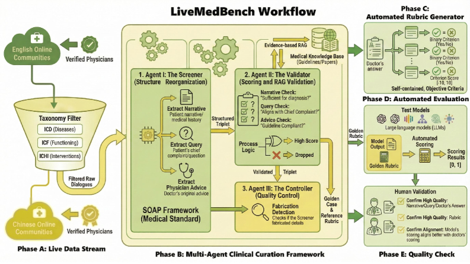

# LiveMedBench: A Contamination-Free Medical Benchmark for LLMs with Automated Rubric Evaluation

[](https://arxiv.org/abs/2602.10367)
[](https://huggingface.co/datasets/JuelieYann/LiveMedBench/)
[](https://zhilingyan.github.io/LiveMedBench/)
[](LICENSE)

**LiveMedBench** is a continuously updated, contamination-free, and rubric-based benchmark for evaluating LLMs on **real-world medical cases**. It is designed to measure not only overall medical quality, but also **robustness over time** and **alignment with physician judgment**.

> **Key Stats:** 2,756 real-world cases | 38 medical specialties | 16,702 unique evaluation criteria | 38 LLMs evaluated | Multilingual (EN/ZH)

<p align="center">
  <a href="https://arxiv.org/abs/2602.10367">Paper</a> |
  <a href="https://huggingface.co/datasets/JuelieYann/LiveMedBench/">Dataset</a> |
  <a href="https://zhilingyan.github.io/LiveMedBench/">Website</a> |
  <a href="#leaderboard">Leaderboard</a>
</p>

---

## Highlights

- **Live & Contamination-Free**: Weekly harvests real-world clinical cases from online medical communities (DXY, MedLive, iCliniq, SDN), ensuring strict temporal separation from model training data.
- **Multi-Agent Clinical Curation**: A three-agent framework (Screener, Validator, Controller) transforms noisy online discussions into evidence-backed, structured clinical cases.
- **Automated Rubric-based Evaluation**: Decomposes physician responses into granular, case-specific criteria, achieving **0.54 Pearson correlation** with physician experts (vs. 0.26 for LLM-as-a-Judge).
- **Comprehensive Coverage**: 38 clinical specialties, 5 behavioral themes, 5 evaluation axes, bilingual (English & Chinese).

---

## Framework Overview



The LiveMedBench pipeline consists of five phases:
1. **Data Collection**: Continuous mining of bilingual clinical data from verified online medical communities.
2. **Multi-Agent Curation**: A hierarchical framework (Screener, Validator, Controller) structures and validates data against medical guidelines.
3. **Rubric Generation**: Automated generation of case-specific evaluation rubrics with bipolar criteria and weighted axes.
4. **Model Evaluation**: Objective evaluation of LLMs using the generated rubrics via a rubric-based grader.
5. **Human QA**: Rigorous human quality assurance to ensure clinical alignment.

---

## Benchmark Challenges


- **84% of models** exhibit performance degradation on post-cutoff cases, confirming pervasive data contamination.
- **35-48% of failures** stem from contextual application errors (not factual knowledge gaps).
- Even the best model (GPT-5.2) achieves only **39.2%**, leaving significant room for improvement.

---

## Data Statistics


| Statistic | Value |
|---|---|
| Total Cases | 2,756 |
| Unique Rubric Criteria | 16,702 |
| Clinical Specialties | 38 |
| Languages | English (1,568) + Chinese (1,188) |
| Data Sources | DXY, MedLive, iCliniq, SDN |
| Avg. Criteria per Case | 6.06 (range: 2-19) |
| Behavioral Themes | 5 |
| Evaluation Axes | 5 (Accuracy, Completeness, Communication Quality, Context Awareness, Safety) |

---

## Leaderboard

> Results on the **full LiveMedBench dataset** (2,756 cases). All models evaluated in a zero-shot setting with temperature 0. Scores represent the mean normalized rubric-based score (higher is better). Full results are available in the [paper](https://arxiv.org/abs/2602.10367).


| Rank | Model | Type | Score (%) |
|:----:|-------|------|:---------:|
| 1 | GPT-5.2 | Proprietary | **39.23** |
| 2 | GPT-5.1 | Proprietary | 38.50 |
| 3 | Grok-4.1 | Proprietary | 28.28 |
| 4 | Baichuan M3 | Open-Source, Medical | 25.61 |
| 5 | GPT-OSS 120B | Open-Source | 25.03 |
| 6 | GLM-4.5 | Open-Source | 22.46 |
| 7 | Gemini 3 Pro | Proprietary | 18.30 |
| 8 | Claude 3.7 Sonnet | Proprietary | 16.99 |
| 9 | Gemini 2.5 Pro | Proprietary | 16.06 |
| 10 | Qwen3-14B | Open-Source | 15.45 |
| 11 | GPT-4.1 | Proprietary | 13.79 |
| 12 | QwQ-32B | Open-Source | 13.50 |
| 13 | Gemini 2.5 Flash | Proprietary | 6.40 |
| 14 | Med-Gemma 27B | Open-Source, Medical | 5.90 |
| 15 | GPT-4o | Proprietary | 5.06 |

<details>
<summary><b>Key Findings</b></summary>

- **Proprietary vs. Open-Source**: Proprietary models generally lead, but the gap is narrowing. GPT-OSS 120B (25.0%) and GLM-4.5 (22.5%) outperform several high-tier proprietary models.
- **General vs. Medical-Specific**: General-purpose models consistently outperform specialized medical models, likely due to scaling advantages. However, medical models show strong parameter efficiency (e.g., Med-Gemma 27B matches Gemini 2.5 Flash).
- **Data Contamination**: 84% of models (32/38) show performance degradation on post-cutoff cases, with the most pronounced drop of 3.99% observed in Kimi-K2.
- **Error Analysis**: The dominant failure mode is contextual application (CNIF: 35-48%), not hallucination or knowledge gaps.

</details>

---

## Repository Structure

```text
LiveMedBench/
  evaluate/
    run_model.py           # Run an LLM on LiveMedBench cases
    evaluate_model.py      # Use GPT-4.1 as a rubric-based grader
    metric_calc.py         # Aggregate scores and compute metrics
  fig/                     # Figures for documentation
  data/                    # (Expected) benchmark data folder – download from HuggingFace
  outputs/                 # (Recommended) folder for model outputs and evaluations
  requirements.txt         # Python dependencies
  LICENSE                  # MIT License
```

---

## Quick Start

### 1. Environment Setup

```bash
conda create -n livemedbench python=3.10 -y
conda activate livemedbench
pip install -r requirements.txt
```

Set your OpenAI API key:

```bash
export OPENAI_API_KEY="sk-..."  # DO NOT hard-code this in code
```

### 2. Download Data

Download the benchmark data from [Hugging Face](https://huggingface.co/datasets/JuelieYann/LiveMedBench/) and place it under the `data/` directory.

### 3. Run Models on LiveMedBench

```bash
python evaluate/run_model.py \
  --data-file data/LiveMedBench_v202601.json \
  --output-file outputs/gpt_results.json \
  --model gpt-5.2-2025-12-11
```

Key arguments:
- `--data-file`: Path to a JSON list of cases.
- `--output-file`: Where to save model outputs.
- `--model`: Any OpenAI-compatible chat model name.
- `--max-cases` (optional): Limit the number of processed cases.
- `--resume` (optional): Resume from an existing output file by `case_id`.

### 4. Rubric-based Evaluation with GPT-4.1

```bash
python evaluate/evaluate_model.py \
  --rubric-file data/LiveMedBench_v202601.json \
  --model-result-file outputs/gpt_results.json \
  --output-file outputs/evaluation_results_gpt.json \
  --response-field model_response \
  --resume (optional)
```

### 5. Compute Metrics

```bash
python evaluate/metric_calc.py \
  --rubric-file data/LiveMedBench_v202601.json \
  --evaluation-dir outputs \
  --output-file outputs/metric_results.txt
```

---

## Data Format

Each case in the rubric-augmented dataset has the following structure:

```json
{
  "case_id": "1",
  "post_time": "2023-04-16T00:00:00",
  "narrative": "A 45-year-old male presents with...",
  "core_request": "What could be causing these symptoms?",
  "doctor_advice": "Based on the symptoms described...",
  "rubric_items": [
    {
      "criterion": "Does the model identify the likely cause as Norovirus?",
      "points": 10
    },
    {
      "criterion": "Does the model incorrectly recommend antibiotics?",
      "points": -5
    }
  ]
}
```

- **Positive `points`**: Reward for including correct clinical information.
- **Negative `points`**: Penalty for hallucinations, contraindications, or safety risks.
- The final per-case score is `clip(sum(weighted_scores) / sum(positive_points), 0, 1)`.

---

## Citation

If you use LiveMedBench in your research, please cite our paper:

```bibtex
@misc{yan2026livemedbenchcontaminationfreemedicalbenchmark,
      title={LiveMedBench: A Contamination-Free Medical Benchmark for LLMs with Automated Rubric Evaluation},
      author={Zhiling Yan and Dingjie Song and Zhe Fang and Yisheng Ji and Xiang Li and Quanzheng Li and Lichao Sun},
      year={2026},
      eprint={2602.10367},
      archivePrefix={arXiv},
      primaryClass={cs.AI},
      url={https://arxiv.org/abs/2602.10367},
}
```

---

## License

This project is licensed under the [MIT License](LICENSE). See the `LICENSE` file for details.

The benchmark data is intended solely for **research evaluation**. It must not be treated as medical advice, used for self-diagnosis or treatment planning, or used for training clinical deployment models without regulatory validation.
